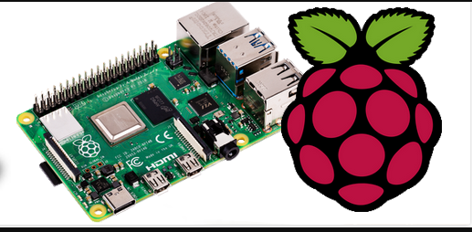

# - Readme !!!

  

## - Segundo Proyecto Cruces Inteligentes con EDGE AI embebido

## Tabla de contenidos
* [🎯Objetivos Específicos](#objetivos-específicos)
* [📂Estructura del repositorio](#estructura-del-repositorio)                                 
* [📂Repositorio](#repositorio)
* [🕒📆Horario de Reuniones](#horario-de-reuniones)
* [👥Roles](#roles)
* [📷Crear Imagen Raspberry Pi 4](#crear-imagen-raspberry-pi-4)
* [Usar este repo como template en GitHub](#usar-este-repo-como-template-en-github)
* [Buenas prácticas](#buenas-prácticas)

# - 🎯Ojetivos Especificos

1. Desarrollar una arquitectura física del sistema embebido por medio
de un análisis operacional del sistema propuesto, y la síntesis de una
propuesta de diseño.

2. Sintetizar un conjunto de aplicaciones de software capaces de
implementar las funcionalidades requeridas para el sistema
embebido por medio del uso de herramientas de visión por
computador y aprendizaje máquina, así como el flujo de trabajo de
Yocto Project con tensorflow lite.

3. Demostrar la operación correcta del sistema embebido mediante la
elaboración de una presentación presencial del desarrollo,
implementación y verificación a partir de casos de uso específicos
para la aplicación propuesta corriendo sobre Raspberry pi.

---

## 📂Estructura del repositorio 

- /src/ → Carpeta para código o mini-proyectos
- /docs/ → Carpeta para notas y documentación
- /imagenes/ → Carpeta para recursos visuales (#imágenes)
- .gitignore → Archivo para ignorar archivos temporales y del sistema
---
# Proyecto de Sistemas Embebidos

## 📂Repositorio

- [Código fuente](src/)
- [Documentación](docs/)
- [Imágenes](imagenes/)

## 🖼 Imagen principal

## 📄 Archivos importantes

- [main.c](src/main.c)
- [Manual PDF](docs/Pro.pdf)

---
## 🕒📆Horario de reuniones

Lunes 5:00 pm a 7:00 pm 

Miercoles 9:00 pm a 10:00 pm

Sabado 3:00 pm a 8:00 pm

## 👥Roles
| Nombre                     | Rol administrativo         | Rol técnico |
| ---                        | ---                        | ---         |
| Carlos Elizondo Alfaro     | Director del Proyecto      | Ingenierio en Sistemas |
| Rodrigo Venegas Mora       | Diseño                     | Lider técnico      | 
| Manuel Garita Brenes       | Auditor                    | Validacion        |
| Manuel Garita Brenes       | Investigador               | Verificación   |

## 📷Crear imagen Raspberry Pi

  

Creado  Proyecto 2 Grupo 2 Carlos Elizondo, Rodrigo Venegas, Manuel Garita de Sistemas Embebidos, IIS 2025.
