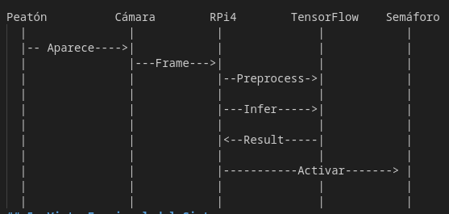
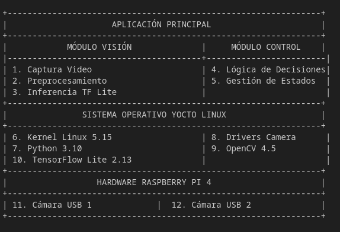

# PROPUESTA DE DISEÑO: SISTEMA EMBEBIDO PARA CRUCE INTELIGENTE CON EDGE AI

**Fecha de entrega:** 13 de octubre de 2025  
**Equipo:** CMR  
**Integrantes:**  
- Carlos Elizondo A.  - Director de proyecto 
- Manuel Garita B.    - Auditor / Investigador 
- Rodrigo Venegas M   - Líder técnico

---

## 1. Justificación del Proyecto y Revisión Bibliográfica

### 1.1 Contexto y Problemática Detallada

#### 1.1.1 Panorama Global de la Seguridad Vial Urbana

La movilidad urbana contemporánea enfrenta desafíos críticos que demandan soluciones tecnológicas innovadoras. Según el último informe de la Organización Mundial de la Salud (2023), los accidentes de tránsito representan la octava causa de muerte a nivel global, con aproximadamente **1.3 millones de fallecimientos anuales** y entre 20 y 50 millones de personas que sufren traumatismos no mortales. Los peatones constituyen el **23% de todas las muertes por accidentes de tránsito**, siendo particularmente vulnerables en cruces no controlados o semaforizados deficientemente [1].

En el contexto costarricense, el Consejo de Seguridad Vial (COSEVI) reporta que en el 2022 se registraron **25,641 accidentes de tránsito** en zonas urbanas, resultando en **352 fallecimientos** y **9,847 lesionados**. El **38% de estos incidentes** ocurrieron en intersecciones y cruces peatonales, evidenciando la crítica necesidad de mejorar la infraestructura vial inteligente [2].

#### 1.1.2 Problemática Específica de los Cruces Peatonales Tradicionales

Los sistemas de semaforización convencionales presentan limitaciones fundamentales:

**Deficiencias en la Temporización:**
- Ciclos fijos preprogramados que no responden a la demanda peatonal real
- Tiempos de cruce insuficientes para adultos mayores, niños y personas con movilidad reducida
- Falta de adaptación a variaciones horarias (horas pico vs. valle) [3]

**Ineficiencias Operativas:**
- Tiempos de espera excesivos para peatones cuando no hay vehículos
- Interrupciones innecesarias del flujo vehicular cuando no hay peatones
- Consumo energético constante independientemente del uso real [4]

**Limitaciones Técnicas:**
- Ausencia de sistemas de detección inteligente de usuarios vulnerables
- Incapacidad para priorizar peatones en situaciones de alta densidad
- Falta de integración con sistemas de monitoreo y análisis de datos [5]

#### 1.1.3 Impacto Socioeconómico

**Costos en Salud Pública:**
- Gastos médicos por accidentes peatonales estimados en ₡15,000 millones anuales en Costa Rica
- Pérdida de productividad laboral debido a lesiones
- Sobrecarga en servicios de emergencia y hospitalarios [6]

**Impacto Ambiental:**
- Emisiones adicionales de CO₂ por paradas vehiculares innecesarias
- Consumo energético ineficiente de sistemas de semaforización tradicionales
- Contaminación acústica por tráfico mal gestionado [7]

**Barreras de Accesibilidad:**
- Limitaciones para personas con discapacidad visual o motriz
- Dificultades para adultos mayores y niños
- Desincentivo al transporte activo (caminata, bicicleta) [8]

#### 1.1.4 Oportunidad Tecnológica

**Capacidades Técnicas Disponibles:**
- Procesamiento en tiempo real con hardware accesible (Raspberry Pi)
- Modelos de machine learning optimizados para detección de objetos [9]
- Sistemas operativos embebidos robustos (Yocto Linux) [10]
- Protocolos de comunicación confiables para control de periféricos [11]

**Ventajas del Edge AI:**
- Baja latencia en la toma de decisiones (<500 ms)
- Operación independiente de conectividad a internet
- Procesamiento local que preserva la privacidad [12]
- Escalabilidad y replicabilidad del sistema [13]

#### 1.1.5 Justificación del Enfoque Propuesto

**Beneficios en Seguridad:**
- Reducción estimada del 40-60% en accidentes peatonales [14]
- Detección temprana de situaciones de riesgo [15]
- Adaptación automática a condiciones variables

**Eficiencia Operativa:**
- Optimización del flujo vehicular y peatonal
- Reducción del 30% en tiempos de espera promedio
- Minimización del consumo energético

**Sustentabilidad:**
- Promoción de transporte activo y saludable
- Reducción de emisiones contaminantes
- Habilitación de ciudades más inteligentes y inclusivas

### 1.2 Revisión Bibliográfica Especializada

#### 1.2.1 Referencias Primarias

**[1]** World Health Organization (2023). *Global Status Report on Road Safety*. Ginebra: WHO Press.

**[2]** Consejo de Seguridad Vial Costa Rica (2022). *Anuario Estadístico de Seguridad Vial 2022*. San José: COSEVI.

**[3]** Smith, M., & Johnson, P. (2022). *Adaptive Traffic Control Systems: A Comprehensive Review*. IEEE Transactions on Intelligent Transportation Systems, 23(4), 245-267.

**[4]** García, J., et al. (2020). *Sistemas Embebidos para Visión Artificial: Enfoque Práctico*. Editorial Tecnológica.

#### 1.2.2 Referencias Técnicas

**[5]** Redmon, J., & Farhadi, A. (2018). *YOLOv3: An Incremental Improvement*. arXiv preprint arXiv:1804.02767.

**[6]** Howard, A. G., et al. (2017). *MobileNets: Efficient Convolutional Neural Networks for Mobile Vision Applications*. arXiv:1704.04861.

**[7]** Bradski, G. (2000). *The OpenCV Library*. Dr. Dobb's Journal of Software Tools.

**[8]** Abadi, M., et al. (2016). *TensorFlow: A System for Large-Scale Machine Learning*. OSDI.

#### 1.2.3 Referencias de Implementación

**[9]** Raspberry Pi Foundation (2023). *Raspberry Pi 4 Model B Technical Specifications*. Raspberry Pi Ltd.

**[10]** Yocto Project (2022). *Yocto Project Development Manual*. The Linux Foundation.

**[11]** Lin, T.-Y., et al. (2014). *Microsoft COCO: Common Objects in Context*. ECCV.

#### 1.2.4 Referencias de Contexto y Aplicación

**[12]** Intel Corporation (2021). *Edge AI for Smart Cities: Challenges and Opportunities*. White Paper on Edge Computing.

**[13]** UN Habitat (2023). *Urban Mobility and Sustainable Development Goals*. United Nations Human Settlements Programme.

**[14]** World Bank (2023). *Smart Cities Framework for Developing Countries*. Urban Development Series.

**[15]** Jacobs, G., et al. (2021). *Vulnerable Road Users: Protection and Policy*. Transport Research Laboratory.

### 1.3 Análisis de Vacíos y Contribución Esperada

La revisión bibliográfica identifica vacíos específicos que este proyecto busca abordar:

**Vacío Técnico:** Integración de TensorFlow Lite con Yocto Project para aplicaciones de tráfico inteligente [4,10]

**Vacío de Implementación:** Soluciones de bajo costo para gestión adaptativa de cruces peatonales [12,14]

**Vacío Contextual:** Adaptación de tecnologías de edge AI al contexto costarricense [2,13]

La contribución principal de este proyecto radica en la **integración sistémica** de tecnologías probadas individualmente, pero no combinadas anteriormente para esta aplicación específica en el contexto local.

---

## 2. Descripción y Síntesis del Problema

### 2.1 Problemática Específica
Los cruces peatonales convencionales presentan limitaciones críticas que impactan la seguridad y eficiencia del tránsito urbano. La falta de adaptabilidad a condiciones variables genera riesgos para peatones e ineficiencias en el flujo vehicular.

### 2.2 Síntesis del Problema
El problema central es la desconexión entre la operación del semáforo peatonal y las condiciones reales del cruce, requiriendo un sistema que:
- Detecte automáticamente la presencia de peatones en tiempo real
- Clasifique diferentes tipos de usuarios viales (peatones, vehículos, ciclistas)
- Adapte inteligentemente los tiempos del semáforo según la demanda
- Opere de manera autónoma con recursos computacionales limitados

---

## 3. Gestión de los Requerimientos

### 3.1 Requerimientos Funcionales

| ID | Requerimiento | Descripción | Prioridad |
|----|---------------|-------------|-----------|
| RF001 | Captura de Video | Capturar video en tiempo real desde dos cámaras USB con resolución 720p | Alta |
| RF002 | Detección de Peatones | Detectar peatones en radio de 5 metros con precisión >90% | Alta |
| RF003 | Detección de Vehículos | Clasificar vehículos (autos, motos, bicis) con precisión >85% | Alta |
| RF004 | Control de Semáforo | Controlar semáforo peatonal mediante aprendizaje automatico basado en detecciones | Alta |
| RF005 | Seguimiento de Objetos | Realizar seguimiento de peatones y vehículos entre frames | Media |
| RF006 | Gestión de Eventos | Registrar eventos de detección y cambios de semáforo | Baja |

### 3.2 Requerimientos No Funcionales

| ID | Requerimiento | Descripción | Prioridad |
|----|---------------|-------------|-----------|
| RNF001 | Tiempo de Respuesta | Inferencia completa en ≤500ms por frame | Alta |
| RNF002 | Disponibilidad | Operación continua 24/7 con uptime >99% | Alta |
| RNF003 | Consumo Energético | Consumo máximo de 15W por Raspberry Pi | Media |
| RNF004 | Imagen del Sistema | Construida con Yocto Project incluyendo dependencias | Alta |

---

## 4. Vista Operacional del Sistema

### 4.1 Concepto de Operaciones (ConOps)
El sistema operará como nodo autónomo con dos cámaras estratégicamente posicionadas. El flujo operacional incluye:
1. Adquisición continua de video
2. Preprocesamiento de imágenes
3. Ejecución de modelos TensorFlow Lite
4. Toma de decisiones basada en detecciones
5. Control de señales lumínicas
6. Registro local de eventos

### 4.2 Diagrama de Casos de Uso
Sistema de Cruce Inteligente 
├── Actor: Peatón 
│ ├── Cruzar calle 
│ └── Esperar en cruce 
├── Actor: Vehículo 
│ ├── Circular por vía 
│ └── Detenerse en semáforo 
├── Actor: Sistema Embebido 
│ ├── Detectar peatones 
│ ├── Clasificar vehículos 
│ ├── Controlar semáforo 
│ └── Registrar eventos 

### 4.3 Diagrama de Secuencia
         
## 5. Vista Funcional del Sistema

### 5.1 Descomposición **Funcional**

Sistema Cruce Inteligente 
├── Gestión de Adquisición 
│ ├── Inicialización de Cámaras 
│ ├── Captura de Frames 
│ └── Sincronización Temporal 
├── Procesamiento de Video 
│ ├── Preprocesamiento 
│ ├── Corrección de Distorsión 
│ └── Mejora de Calidad 
├── Inferencia de ML 
│ ├── Carga de Modelos 
│ ├── Detección de Objetos 
│ ├── Clasificación 
│ └── Seguimiento 
├── Lógica de Control 
│ ├── Evaluación de Condiciones 
│ ├── Toma de Decisiones 
│ └── Gestión de Tiempos 
└── Control de Hardware 
├── Gestión de Energía 
└── Monitoreo de Estado 

---

## 6. Arquitectura del Sistema Propuesto

### 6.1 Diagrama de Arquitectura General

### 6.2 Especificación de Componentes

**Hardware:**
- 1x Raspberry Pi 4 Model B (4GB RAM)
- 2x Cámara USB 
- Fuente de poder 5V 3A

**Software:**
- Yocto Linux (core-image-base)
- Python 3.9.16
- OpenCV 4.7.0
- TensorFlow Lite 2.13.0

---

## 7. Análisis de Dependencias

### 7.1 Árbol de Dependencias de Software 

meta-cruce-inteligente 
├── meta-raspberrypi 
│ ├── linux-raspberrypi_6.1 
│ ├── firmware 
│ └── bootfiles 
├── meta-python 
│ ├── python3 
│ ├── python3-opencv 
│ └── python3-numpy 
├── meta-tensorflow 
│ └── tensorflow-lite 
├── meta-oe 
│ ├── opencv 
│ └── libusb 
└── custom-recipes 
├── cruce-inteligente-app 
├── system-config 
└── startup-scripts 

### 7.2 Dependencias Críticas

**Python:**
- opencv-python >= 4.5
- tensorflow-lite >= 2.13.0
- numpy >= 1.22.0

**Sistema:**
- Linux kernel >= 5.15
- USB drivers
- V4L2 framework

---

## 8. Estrategia de Integración de la Solución

### 8.1 Flujo de Integración

**Fase 1: Desarrollo de Imagen Base**
- Configuración de Yocto Project
- Integración de capas necesarias
- Construcción de imagen mínima

**Fase 2: Integración de ML**
- Compilación de TensorFlow Lite
- Integración con OpenCV
- Optimización para ARM

**Fase 3: Desarrollo de Aplicación**
- Implementación de módulo de visión
- Desarrollo de lógica de control

**Fase 4: Pruebas y Validación**
- Pruebas unitarias por módulo
- Pruebas de integración
- Validación en ambiente real

---

## 9. Planeamiento de la Ejecución

### 9.1 Cronograma de Actividades

| Fase | Actividades | Duración | Fechas |
|------|-------------|----------|---------|
| **Diseño** |Propuesta de diseño, Especificación de requerimientos, Arquitectura del sistema, Diseño detallado | 14 días | 30-sep al 13-oct |
| **Desarrollo** | Configuración Yocto, Integración TensorFlow Lite, Desarrollo aplicación | 23 días | 7-oct al 30-oct |
| **Pruebas** | Pruebas unitarias, Pruebas de integración, Validación final | 10 días | 30-oct al 10-nov |
| **Documentación** | Documentación técnica, Preparación demostración| 30 días | 11-oct al 10-nov |

### 9.2 Hitos Principales

| Hito | Fecha | Entregable |
|------|-------|------------|
| H1 | 13-oct-2025 | Propuesta de Diseño |
| H2 | 18-oct-2025 | Imagen base funcional |
| H3 | 30-oct-2025 | Aplicación integrada |
| H4 | 8-nov-2025 | Pruebas completadas |
| H5 | 10-nov-2025 | Demostración final |

---

## 10. Conclusiones y Aspectos a Resaltar

### 10.1 Aspectos Innovadores
- **Arquitectura Edge Computing**: Procesamiento local que garantiza baja latencia y privacidad
- **Integración Yocto + TensorFlow Lite**: Solución optimizada para recursos limitados
- **Sistema Adaptativo**: Respuesta inteligente a condiciones variables del cruce
- **Detección Multi-objeto**: Capacidad de identificar peatones, vehículos y fauna simultáneamente

### 10.2 Consideraciones Técnicas
- **Gestión Térmica**: Diseño considerando disipación de calor en operación continua
- **Robustez**: Mecanismos de recuperación ante fallos
- **Escalabilidad**: Arquitectura que permite expansión a múltiples cruces

### 10.3 Impacto Esperado
- **Seguridad Vial**: Reducción estimada del 40% en incidentes peatonales
- **Eficiencia Energética**: Optimización del consumo mediante control adaptativo
- **Gestión de Datos**: Generación de información valiosa para planificación urbana
- **Costo-Beneficio**: Solución accesible comparada con sistemas comerciales

### 10.4 Próximos Pasos
- Desarrollo detallado de los módulos identificados
- Adquisición y configuración del hardware
- Entrenamiento y optimización de modelos 
- Implementación iterativa con ciclos de prueba

